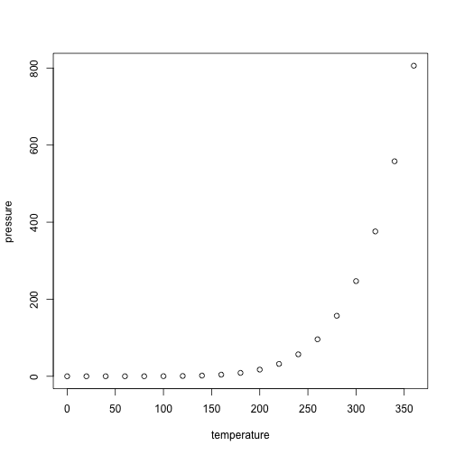

## Anova Test

testing groups to see if there’s a difference between them.

### Assumption

#### Normality

The population must be close to a normal distribution.


```
##      speed           dist       
##  Min.   : 4.0   Min.   :  2.00  
##  1st Qu.:12.0   1st Qu.: 26.00  
##  Median :15.0   Median : 36.00  
##  Mean   :15.4   Mean   : 42.98  
##  3rd Qu.:19.0   3rd Qu.: 56.00  
##  Max.   :25.0   Max.   :120.00
```

## Including Plots

You can also embed plots, for example:




```r
head(KWH)
```

```
## [1]  5270.742 12173.000 19655.394  9852.535  3115.655  2777.000
```

Note that the `echo = FALSE` parameter was added to the code chunk to prevent printing of the R code that generated the plot.
